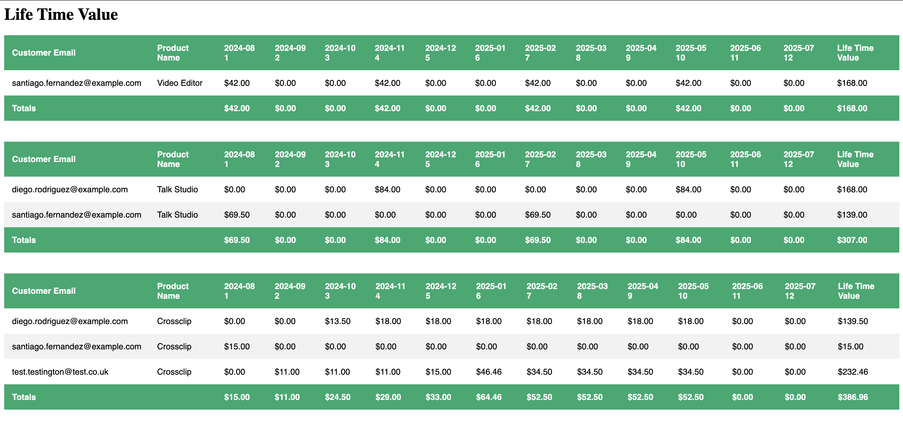

# Jeffrey Moen Notes

## Notes About Stripe Test Clocks

I have been working on a command that simulates a year's worth of transactions on Stripe, but I ran into the following issues:

1. When you advance a Stripe test clock it can take several minutes to finish processing.
2. You can only advance the test clock as much as 2-months at a time, but the requests must be run synchronously & are prone to race conditions.
    1. You will eventually hit a race condition where the timestamp you provide exceeds their maximum allowable value:
    2. `The frozen time of this clock is 1732320000 (2024-11-23 00:00:00 UTC). You can only advance it up to 1737590400 (2025-01-23 00:00:00 UTC). You can only advance a test clock up to two intervals from the current frozen time at a time, based on the shortest subscription interval in the test clock. For example, if a test clock has a monthly and yearly subscription, you may only advance up to two months at a time. If the test clock has no subscriptions or subscription schedules, you can advance up to 2 years from the current frozen time.`
3. Stripe returns a 200 early & allows the simulation to continue running on their servers, so it's not as simple as waiting for one request to finish & then have the next one run.
    1. Potential ways to address this would be:
        1. Retry logic that adds a sleep call to give it more time to finish, & then retry the transaction
        2. Advance a smaller timeframe like 1-week instead of 2-months, but it was still hit the race condition after a few requests
        2. Setting up something like polling to wait & see when advancing the time clock is done on Stripe's side, though I did not come across anything for that.
        3. There are also tools like Temporal, that could be used to add more robust retry logic, but that is overkill for this case.
4. To safely guarantee that the script would run to completion without hitting the race condition, I would need to add a sleep time of at least 2-3 minutes or set up a queueing & retry system.
    1. Running the automated script as it stands would take 2 to 4.5 hours run.
5. With that in mind, the faster solution is to run the simulations manually, wait for them to complete & then trigger the next simulation.
6. Then after advancing to the 15th of the 5th month, run a command to update the subscription of the user I created (Test Testington) & then continue on with running the simulation through the year.
7. Given that the limitation is on Stripe's side for the simulations taking up to a few minutes to run, this is a reasonable workaround.
8. I will still include an automated way to run this, but it is not the recommended way to run this.

## Setup

1. Generate an application key - `vendor/bin/sail artisan key:generate`
2. Install the Stripe CLI - `brew install stripe/stripe-cli/stripe`
3. Login to Stripe - `stripe login`

## Running Code
1. Create the Stripe test clock and add its value the .env value `STRIPE_TEST_CLOCK`
2. Run DB migrations - `vendor/bin/sail artisan migrate:refresh`
3. Run fixtures - `stripe fixtures fixtures/seed.json`
4. Seed DB with the records created from Stripe - `vendor/bin/sail artisan db:seed`
    1. This script pulls the data we created on Stripe directly from their APIs and stores it in the DB
    2. This way we have access to the internal Stripe IDs for resources like customers, products, invoices, etc
5. Warning: This command will take several hours to run & it is not the recommended way to proceed
    1. `vendor/bin/sail artisan app:simulate-year-of-transactions`
        1. This will make 52-requests to Stripe, each simulating 1-week of transactions
        2. There is a configurable sleep variable in the env that should be set to at least 180-seconds
        3. It will send out a request to update the user I added (Test Testington's) subscription for the 15th day of the 5th month
        4. Upon completion run `vendor/bin/sail artisan db:seed` to re-seed the DB with all transaction data from Stripe.
6. To work around the performance issues, I recommend running the Test Clock simulations manually.
    1. Simulate ahead 2-months (2-months total)
    2. Simulate ahead 2-months more (4-months total)
    3. Simulate ahead to the 15th day of the 5th month 1.5-months (5.5-months total)
    4. Run this command to update the subscription for the customer I added, `vendor/bin/sail artisan app:update-test-customer-subscription`
    5. Simulate ahead 2-months (7.5-months total)
    6. Simulate ahead 2-months (9.5-months total)
    7. Simulate ahead 2-months (11.5-months total)
    8. Simulate ahead 0.5 months to 1-year from the original date (1-year total)
7. Run `vendor/bin/sail artisan db:seed` to re-seed the DB with all transaction data
8. View the results with a table per product at http://localhost/

## Results

1. Noticed that Diego's subscription for Video Editor disappears after 10-months.
    1. This is because that subscription is set to cancel & then is eventually deleted.
        1. The `GET /v1/customers` endpoint does not return deleted customers
        2. You can still retrieve deleted customers individually using `GET /v1/customers/:customerId`
    2. This showed up because I reseed the DB after running the simulations & the seeding request was only returning active subscriptions.
        1. If this were a production system, I would add & update records using webhooks and I would change the state or soft-delete deleted subscriptions, so that data would be preserved.
3. Proration for the test customer is working.
    1. I did notice that the customer is billed for 15 GBP and then are charged a prorated amount of 31.46, which totals to 46.46 GBP.
    2. In practice, they should be refunded or credited what they already paid for their previous product when upgrading to a new product.

## Other Notes

1. I had gone down the path of creating my test customer directly through Stripe's APIs to demonstrate API usage.
    1. However, I decided to switch to using the fixtures to create the example user.
    2. I did keep the code for the API calls there and they all work.
    3. The issue was creating the payment method where Stripe does not want you want to send credit card numbers as part of a request.
        1. In practice, I would create the credit card on Stripe or using Stripe's payment form, but since my goal was to make this an automated process. It made more sense to use the fixture to create the payment method & by extension the test user using fixtures.
2. Testing
    1. Given the time constraints & exploratory nature of this project, I opted to shift my focus to demonstrating knowledge of Stripe by working with their APIs, SDK, & fixtures over writing test coverage.
    2. For test coverage, I would set up unit test coverage to show that the methods behave as expected and integration tests to prove that the overall functionality worked.
    3. I am interested in using time clocks more for testing. At a previous employer, we had starting using time clocks, but QA was not on board, so I developed a different testing strategy based off the payloads from webhooks, to simulate the lifecycle of Stripe transactions.
        1. That method worked well, setting up time clocks & running simulations is a much better way to test Stripe's behavior.

Thank you for choosing to invest your time in this assignment.  We recognize it’s difficult to find the time to complete a coding assignment, and we value your time and investment in this process with us.
# Streamlabs Senior Payments Assignment

You've been tasked with creating an analysis for how subscriptions behave over the course of a year and the expected revenue from those subscriptions.

You will be assessing the estimated revenue for 3 different subscription products. You've been provided seed data for 3 different products, 2 existing customers and their subscriptions.

## Requirements
- Return a table for each product that lists out a subscription per row.
- The columns should be the following: customer email, product name, ...months 1-12, lifetime value for subscription. The final row should contain usd totals for each month.
- Using the Stripe API, create a new customer and subscribe them to the following:
  - Price: `${price_monthly_crossclip_basic:id}`
  - Coupon: `${coupon_5_off_3_months:id}`
  - Trial: 30 days
  - Currency: `gbp`
- For your created subscription, during the 5th month perform a mid-cycle upgrade with proration on the 15th to the following:
  - Price: `${price_monthly_crossclip_premium:id}`
- **You can display these tables via HTML or command line output.**

| Customer Email            | Product Name | {endOfMonth date} 1 | {endOfMonth} 2 | {endOfMonth} 3 | {endOfMonth} 4 | {endOfMonth} 5 | {endOfMonth} 6 | {endOfMonth} 7 | {endOfMonth} 8 | {endOfMonth} 9 | {endOfMonth} 10 | {endOfMonth} 11 | {endOfMonth} 12 | Life Time Value |
|---------------------------|--------------|---------------------|----------------|----------------|----------------|----------------|----------------|----------------|----------------|----------------|-----------------|-----------------|-----------------|-----------------|
| your.customer@example.com | Product A    | $0                  | $10            | $10            | $10            | $10            | $10            | $10            | $10            | $0             | $0              | $0              | $0              | $80             |
| john.doe@example.com      | Product A    | $10                 | $10            | $10            | $10            | $10            | $10            | $10            | $10            | $0             | $0              | $0              | $0              | $80             |
| jane.smith@example.com    | Product A    | $15                 | $15            | $15            | $15            | $15            | $15            | $15            | $15            | $15            | $15             | $15             | $15             | $180            |
| **Totals**                |              | **$25**             | **$25**        | **$25**        | **$25**        | **$25**        | **$25**        | **$25**        | **$25**        | **$15**        | **$15**         | **$15**         | **$15**         | **$260**        |

| Customer Email       | Product Name | {endOfMonth} 1 | {endOfMonth} 2 | {endOfMonth} 3 | {endOfMonth} 4 | {endOfMonth} 5 | {endOfMonth} 6 | {endOfMonth} 7 | {endOfMonth} 8 | {endOfMonth} 9 | {endOfMonth} 10 | {endOfMonth} 11 | {endOfMonth} 12 | Life Time Value |
|----------------------|--------------|----------------|----------------|----------------|----------------|----------------|----------------|----------------|----------------|----------------|-----------------|-----------------|-----------------|-----------------|
| john.doe@example.com | Product B    | $10            | $10            | $10            | $10            | $10            | $10            | $10            | $10            | $0             | $0              | $0              | $0              | $80             |
| jane.smith@example.com | Product B    | $15            | $15            | $15            | $15            | $15            | $15            | $15            | $15            | $15            | $15             | $15             | $15             | $180            |
| **Totals**           |              | **$25**        | **$25**        | **$25**        | **$25**        | **$25**        | **$25**        | **$25**        | **$25**        | **$15**        | **$15**         | **$15**         | **$15**         | **$260**        |

| Customer Email       | Product Name | {endOfMonth} 1 | {endOfMonth} 2 | {endOfMonth} 3 | {endOfMonth} 4 | {endOfMonth} 5 | {endOfMonth} 6 | {endOfMonth} 7 | {endOfMonth} 8 | {endOfMonth} 9 | {endOfMonth} 10 | {endOfMonth} 11 | {endOfMonth} 12 | Life Time Value |
|----------------------|--------------|----------------|----------------|----------------|----------------|----------------|----------------|----------------|----------------|----------------|-----------------|-----------------|-----------------|-----------------|
| john.doe@example.com | Product C    | $10            | $10            | $10            | $10            | $10            | $10            | $10            | $10            | $0             | $0              | $0              | $0              | $80             |
| jane.smith@example.com | Product C    | $15            | $15            | $15            | $15            | $15            | $15            | $15            | $15            | $15            | $15             | $15             | $15             | $180            |
| **Totals**           |              | **$25**        | **$25**        | **$25**        | **$25**        | **$25**        | **$25**        | **$25**        | **$25**        | **$15**        | **$15**         | **$15**         | **$15**         | **$260**        |

## Guiding Philosophy

The assignment should take about 4 hours to complete. We want to see a well-modeled, working solution that shows that you can write code and read directions.

We are NOT

- going to throw any "gotchas" at you or your submission,
- testing for your ability to suss out edge cases, or
- trying to trick you.

Keep it simple! Please do NOT implement extra features that we don't ask for.

## Stack
At Streamlabs we mainly make use of PHP, Laravel, Vue, React, TypeScript, MySQL. Please make use of Laravel & PHP for this assignment so we know you are familiar with our backend stack.

## Prerequisites

### Stripe
You will be heavily working with stripe for this assignment. You will need to create a stripe account.

Stripe Concepts:
- [Stripe CLI](https://docs.stripe.com/cli)
- [Stripe Fixtures](https://docs.stripe.com/cli/fixtures)
- [Stripe Test Clocks and Simulations](https://docs.stripe.com/billing/testing/test-clocks/api-advanced-usage)
- [Stripe API - Customers, Subscriptions, Products, Prices, and Coupons](https://docs.stripe.com/api?lang=php)

## Getting Started
- (Optional) Laravel Sail can be used for this project. You can find the documentation [here](https://laravel.com/docs/11.x/sail)
  - copy .env.example to .env
  - install composer dependencies with `docker run --rm --interactive --tty --name tmp-composer-install --volume $PWD:/app composer install --ignore-platform-reqs --no-scripts`
  - get the app going with `vendor/bin/sail up -d`
  - run `vendor/bin/sail key:generate`
  - visit `localhost` in your browser to see the app running
  - includes stripe cli 
- Create a new stripe account
- Use the stripe CLI to login and authorize to newly created account
- Create a [stripe test clock](https://dashboard.stripe.com/test/billing/subscriptions/test-clocks) to simulate time
- Once you've added your test clock you can use stripe cli to run your fixture. Fixture is located at fixtures/seed.json
  - The fixture will populate data into your stripe account

> **Warning:** You'll likely have to create multiple test clocks and seed data multiple times. This is normal and expected. While all data will be constrained by each test clock you can delete all stripe data by going to the [Stripe Developers](https://dashboard.stripe.com/test/developers) page and selecting "Delete all test data" option at the bottom of the page.

## Documentation & Thought Process
The code is to be published on a public github repository for our team to access. Make sure that we can see your progress in your commit history, a single commit is not enough.

**Please include a README.md file that includes the following information:**

- A screenshot of your final output
- Instructions on how to run your code and any tests